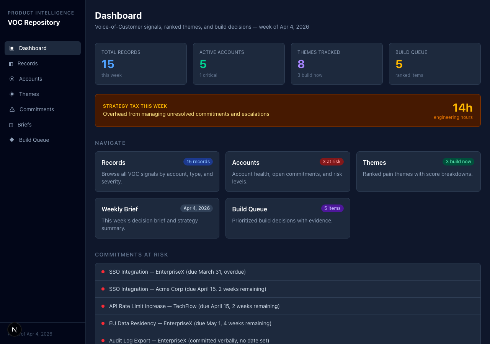
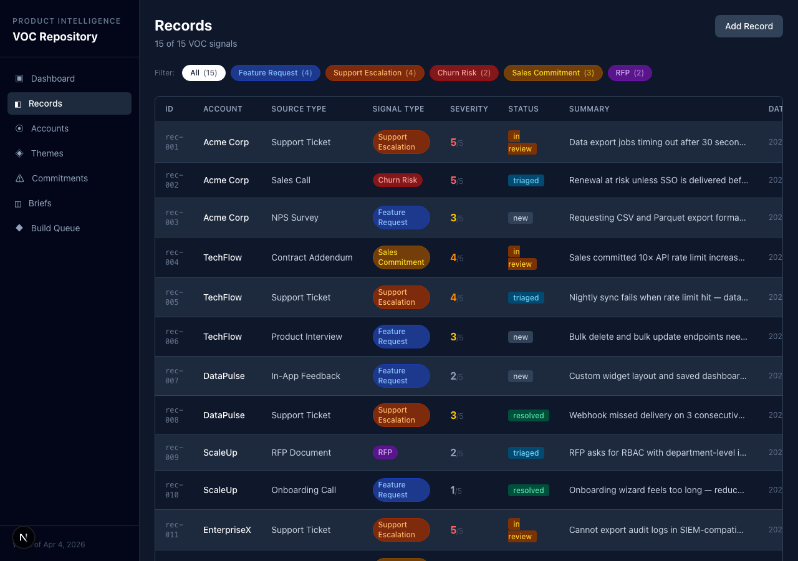
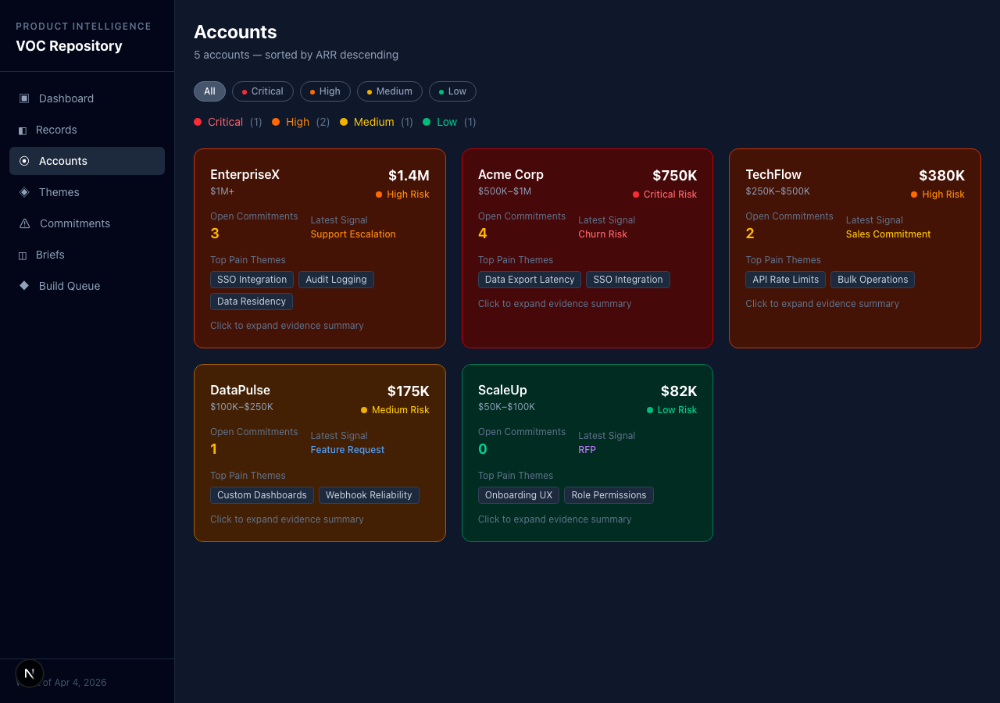
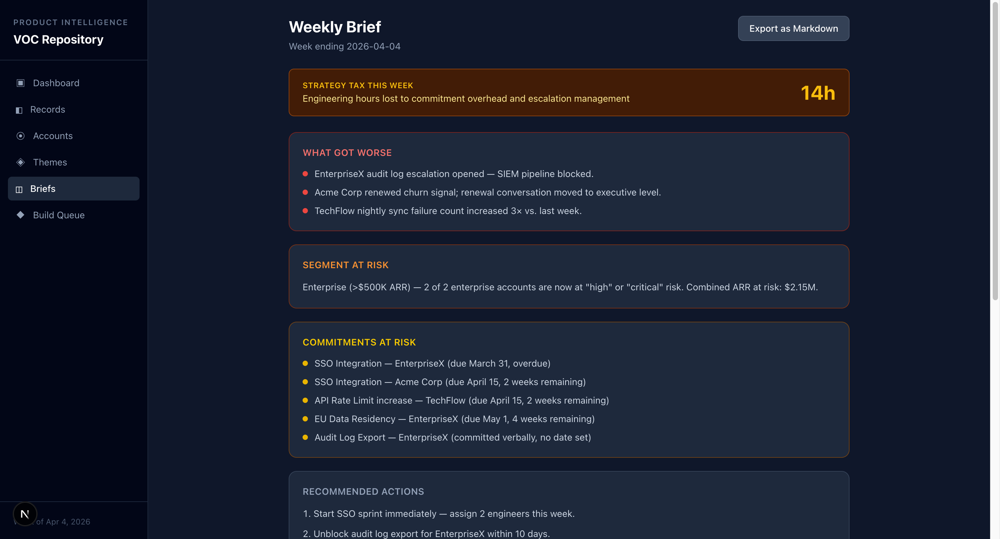
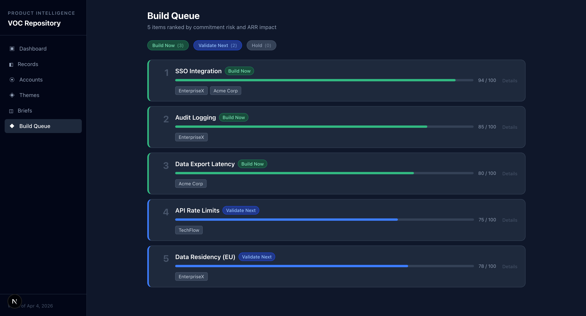

# Web App Idea Lab

[](https://github.com/akillness/web-app-idea-lab/actions/workflows/deploy.yml)
[](https://akillness.github.io/web-app-idea-lab/)
[](https://nextjs.org/)
[](https://www.typescriptlang.org/)
[](https://tailwindcss.com/)
[](https://playwright.dev/)
[](LICENSE)

## VOC Repository — Live Web App

> **B2B SaaS 팀을 위한 고객의 목소리 의사결정 시스템**
>
> 지원/이탈/기능 요청/약속 관련 기록을 **고객 단위 근거 보드, 주간 의사결정 브리프, 우선순위 빌드 큐, 안전한 약속 업데이트 초안**으로 바꿔주는 의사결정·설명 레이어.

### 프로젝트 목적

이 프로젝트는 흩어진 고객 신호를 한 번에 읽고, 팀이 같은 우선순위로 의사결정하게 만드는 **VOC 운영 인터페이스**를 데모 가능한 형태로 보여주기 위한 것이다.

핵심 질문은 네 가지다.
- 지금 어떤 account가 가장 위험한가?
- 어떤 테마를 바로 build 해야 하는가?
- 어떤 약속가 위험하게 관리되고 있는가?
- PM / CSM / Founder가 같은 근거를 보고 같은 결론에 도달할 수 있는가?

### 용도

- 제품 아이디어 검증용 인터랙티브 데모
- PM/경영진 공유용 GitHub Pages 쇼케이스
- 이후 실제 백엔드를 붙이기 전 UX 기준 화면
- PR/포트폴리오에서 설명 가능한 실행 가능한 프로토타입

### 음성 인식 모델

- 현재 버전은 **음성 인식 기능을 포함하지 않음**
- 사용 중인 STT(음성인식) 모델: **없음**
- 추후 음성 입력 기능을 붙일 경우 모델명과 버전을 README와 앱에 명시할 예정

### 실제 현재 동작 방식

현재 구현은 **두 층**으로 나뉜다.

1. `webapp/`
   - Next.js 기반 read-only 제품 데모
   - 타입이 지정된 샘플 데이터로 dashboard / records / accounts / 테마s / 약속s / briefs / queue를 렌더링
   - GitHub Pages에 정적 export 가능

2. `src/voc_repository/`
   - raw 근거 JSON을 ranked build-next queue markdown으로 바꾸는 Python CLI
   - 제품 컨셉의 우선순위 로직을 작은 실행 가능 형태로 검증

즉, 이 저장소는 “아이디어 문서”만 있는 게 아니라 **실제 UI 데모 + 실제 CLI 프로토타입**이 같이 들어 있는 구조다.

### 🚀 Live Demo
**[https://akillness.github.io/web-app-idea-lab/](https://akillness.github.io/web-app-idea-lab/)**

---

### 📱 App Screens

| Screen | Route | Description |
|--------|-------|-------------|
| **Dashboard** | `/` | Stats overview, strategy-tax metric, 약속s at risk, quick navigation |
| **Records** | `/records` | Customer signal records with filter chips, source type & severity, intake form |
| **Accounts** | `/accounts` | Evidence board with ARR, health risk filters, linked records drill-down |
| **Themes** | `/테마s` | Ranked 테마 board with recommendation filter (Build Now / Validate Next / Hold) |
| **Briefs** | `/briefs` | Weekly decision brief with markdown export |
| **Build Queue** | `/queue` | Ranked build-next decision queue with linked 근거 |
| **Commitments** | `/약속s` | At-risk 약속s tracker grouped by account |

---

### 🖼 Screenshots

<table>
  <tr>
    <td align="center"><strong>Dashboard</strong><br></td>
    <td align="center"><strong>Records</strong><br></td>
  </tr>
  <tr>
    <td align="center"><strong>Accounts</strong><br></td>
    <td align="center"><strong>Themes</strong><br></td>
  </tr>
  <tr>
    <td align="center"><strong>Weekly Brief</strong><br></td>
    <td align="center"><strong>Build Queue</strong><br></td>
  </tr>
  <tr>
    <td align="center"><strong>Commitments</strong><br></td>
    <td align="center"></td>
  </tr>
</table>

---

### 🏗 Architecture

```
web-app-idea-lab/
├── webapp/                          # Next.js 16 web app (GitHub Pages)
│   ├── app/
│   │   ├── lib/
│   │   │   ├── sample-data.ts       # Typed VOC sample data (5 accounts, 15 records, 8 테마s)
│   │   │   └── ui-config.ts         # Shared signal badge / label config
│   │   ├── components/
│   │   │   ├── NavLinks.tsx         # Active nav via usePathname()
│   │   │   └── ExportButton.tsx     # Markdown export (use client)
│   │   ├── records/
│   │   │   ├── page.tsx             # Signal records + intake form
│   │   │   └── RecordModal.tsx      # Add record modal form
│   │   ├── accounts/                # Evidence board with health risk filter
│   │   ├── 테마s/                  # Ranked 테마s with recommendation filter
│   │   ├── 약속s/             # At-risk 약속s tracker
│   │   ├── briefs/                  # Weekly decision brief
│   │   └── queue/                   # Build-next queue
│   ├── e2e/voc-app.spec.ts          # 49 Playwright E2E tests
│   └── next.config.mjs              # Static export config
├── src/voc_repository/              # Python CLI (existing)
├── .github/workflows/deploy.yml     # CI/CD → GitHub Pages
├── .jeo/                            # JEO project ledger
└── develop/                         # Development plans
```

### ⚡ 실제 사용 방법

#### 웹앱 로컬 실행
```bash
cd webapp
npm install
npm run dev        # http://localhost:3000
```

#### GitHub Pages와 동일한 경로로 로컬 확인
```bash
cd webapp
npm run build:pages
npm run preview:pages
# http://localhost:4173/web-app-idea-lab/
```

#### Python CLI 실행
```bash
python3 -m venv .venv
source .venv/bin/activate
python -m pip install -e .[test]
python -m voc_repository.cli payload.json
```

#### 검증
```bash
cd webapp
npm run typecheck
npm run lint
npm run build
npm run build:pages
npx playwright test e2e/voc-app.spec.ts
```

### 배포가 실제로 동작하는 방식

- 실제 GitHub Pages 배포 repo: `akillness/web-app-idea-lab`
- fork repo(`JEO-tech-ai/web-app-idea-lab`)에서는 test/lint 위주 CI만 수행
- Pages deploy job은 canonical repo에서만 실행되도록 workflow를 분리해 fork 권한 문제를 피함

즉, **PR에서 기능을 검증하고, canonical repo에서 실배포하는 방식**이 현재 가장 안정적인 동작 경로다.

### 데모 시나리오 3개

#### 1) PM 우선순위 정렬 시나리오
1. `/` 에서 전체 상태와 strategy-tax를 확인한다.
2. `/테마s` 로 이동해 Build Now / Validate Next / Hold 필터를 바꿔본다.
3. `/queue` 에서 ranked build-next 항목을 확인한다.

이 시나리오는 “무엇을 먼저 만들지”를 설명할 때 적합하다.

#### 2) CSM / Account Risk 점검 시나리오
1. `/accounts` 에서 health risk 필터를 바꾼다.
2. linked records drill-down으로 특정 계정 근거를 본다.
3. `/약속s` 에서 위험한 약속/커밋먼트가 어디에 몰려 있는지 확인한다.

이 시나리오는 “어떤 고객 대응이 급한지”를 보여줄 때 적합하다.

#### 3) 리더십 Briefing 시나리오
1. `/briefs` 에서 주간 decision brief를 본다.
2. Markdown export를 실행해 공유 가능한 초안을 만든다.
3. 필요하면 Python CLI로 근거 payload를 queue markdown으로 변환해 비교한다.

이 시나리오는 “근거 → decision brief → 공유 문서” 흐름을 설명할 때 적합하다.

---

### 🔧 Tech Stack

| Layer | Technology |
|-------|-----------|
| Framework | Next.js 16 (App Router, 정적 export) |
| Language | TypeScript 5 (strict mode) |
| Styling | Tailwind CSS 4 |
| Testing | Playwright (E2E, 49 tests) |
| Deployment | GitHub Actions → GitHub Pages |
| Data | Typed sample data (no 백엔드) |

---

혼란 줄이기 위해 저장소를 **3단계 산출물 구조**로 단순화했다.

## 구조
1. `search/` — 최신 검색/시장 신호 요약
2. `ideas/` — 현재 유지하는 명확한 아이디어 정의
3. `develop/` — 실제 개발 착수용 최신 계획

## 현재 유지하는 최신 산출물
### Search
- `search/latest-market-map.md`

### Ideas
- `ideas/primary-voc-repository.md`
- `ideas/backup-creator-deal-crm.md`

### Develop
- `develop/primary-voc-repository.md`
- `develop/backup-creator-deal-crm.md`

## 운영 원칙
- 단계별 최신 파일만 유지한다.
- 루프 과정 로그, 중간 메모, 반복 토론 파일은 남기지 않는다.
- 새로운 근거가 생기면 기존 최신 파일을 **덮어써서 갱신**한다.
- 목표는 `명확한 아이디어 + 세밀한 개발 계획`이다.

## 현재 결론
- Primary idea: **고객의 목소리 Repository**
- Backup idea: **Creator Deal CRM**

## VOC build-next queue CLI
`voc_repository` 패키지는 raw 근거 JSON을 ranked build-next queue markdown으로 바꾸는 작은 파이프라인/CLI를 포함한다.

### Minimal payload example
```json
{
  "records": [
    {
      "record_id": "rec-1",
      "source_type": "support",
      "source_preset": "support ticket",
      "account_id": "acct-1",
      "account_name": "Acme",
      "arr_importance": 0.95,
      "recency": 0.9
    }
  ],
  "signals": [
    {
      "signal_id": "sig-1",
      "record_id": "rec-1",
      "테마_id": "테마-roadmap",
      "canonical_label": "Commitment-safe roadmap updates",
      "signal_type": "support_escalation",
      "severity": 0.95,
      "약속_risk": 1.0,
      "priority_override": 0.8,
      "override_reason": "renewal pressure",
      "근거_span": "Customer asked for safer roadmap guidance before renewal."
    }
  ]
}
```

### Usage
```bash
python -m voc_repository.cli payload.json
python -m voc_repository.cli payload.json --output build-next-queue.md
```

`signals[].signal_type`는 아래 값만 허용한다.
- `feature_request`
- `support_escalation`
- `churn_risk`
- `sales_약속`
- `rfp`

설치된 패키지에서는 console script도 사용할 수 있다.

```bash
voc-build-next-queue payload.json
```
