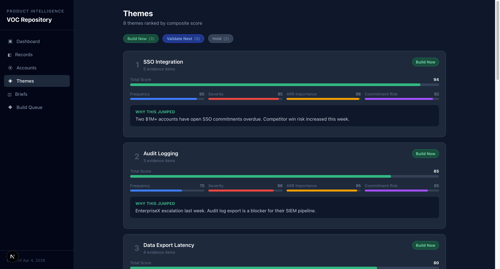
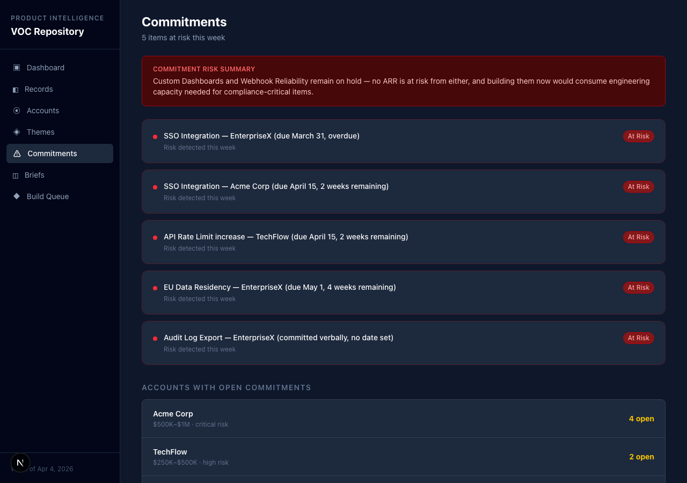

# Web App Idea Lab

[](https://github.com/akillness/web-app-idea-lab/actions/workflows/deploy.yml)
[](https://akillness.github.io/web-app-idea-lab/)
[](https://nextjs.org/)
[](https://www.typescriptlang.org/)
[](https://tailwindcss.com/)
[](https://playwright.dev/)
[](LICENSE)

## VOC Repository — Live Web App

> **B2B SaaS 팀을 위한 Voice-of-Customer 의사결정 시스템**
>
> Support / churn / feature request / commitment records를 **customer-level evidence board, 주간 의사결정 브리프, ranked build-next queue, commitment-safe update draft**로 바꿔주는 decision + explanation layer.

### 🚀 Live Demo
**[https://akillness.github.io/web-app-idea-lab/](https://akillness.github.io/web-app-idea-lab/)**

---

### 📱 App Screens

| Screen | Route | Description |
|--------|-------|-------------|
| **Dashboard** | `/` | Stats overview, strategy-tax metric, commitments at risk, quick navigation |
| **Records** | `/records` | Customer signal records with filter chips, source type & severity, intake form |
| **Accounts** | `/accounts` | Evidence board with ARR, health risk filters, linked records drill-down |
| **Themes** | `/themes` | Ranked theme board with recommendation filter (Build Now / Validate Next / Hold) |
| **Briefs** | `/briefs` | Weekly decision brief with markdown export |
| **Build Queue** | `/queue` | Ranked build-next decision queue with linked evidence |
| **Commitments** | `/commitments` | At-risk commitments tracker grouped by account |

---

### 🖼 Screenshots

<table>
  <tr>
    <td align="center"><strong>Dashboard</strong><br></td>
    <td align="center"><strong>Records</strong><br></td>
  </tr>
  <tr>
    <td align="center"><strong>Accounts</strong><br></td>
    <td align="center"><strong>Themes</strong><br></td>
  </tr>
  <tr>
    <td align="center"><strong>Weekly Brief</strong><br></td>
    <td align="center"><strong>Build Queue</strong><br></td>
  </tr>
  <tr>
    <td align="center"><strong>Commitments</strong><br></td>
    <td align="center"></td>
  </tr>
</table>

---

### 🏗 Architecture

```
web-app-idea-lab/
├── webapp/                          # Next.js 16 web app (GitHub Pages)
│   ├── app/
│   │   ├── lib/
│   │   │   ├── sample-data.ts       # Typed VOC sample data (5 accounts, 15 records, 8 themes)
│   │   │   └── ui-config.ts         # Shared signal badge / label config
│   │   ├── components/
│   │   │   ├── NavLinks.tsx         # Active nav via usePathname()
│   │   │   └── ExportButton.tsx     # Markdown export (use client)
│   │   ├── records/
│   │   │   ├── page.tsx             # Signal records + intake form
│   │   │   └── RecordModal.tsx      # Add record modal form
│   │   ├── accounts/                # Evidence board with health risk filter
│   │   ├── themes/                  # Ranked themes with recommendation filter
│   │   ├── commitments/             # At-risk commitments tracker
│   │   ├── briefs/                  # Weekly decision brief
│   │   └── queue/                   # Build-next queue
│   ├── e2e/voc-app.spec.ts          # 49 Playwright E2E tests
│   └── next.config.mjs              # Static export config
├── src/voc_repository/              # Python CLI (existing)
├── .github/workflows/deploy.yml     # CI/CD → GitHub Pages
├── .jeo/                            # JEO project ledger
└── develop/                         # Development plans
```

### ⚡ Local Development

```bash
cd webapp
npm install
npm run dev        # http://localhost:3000
npm run build      # Static export to /out
npx playwright test e2e/voc-app.spec.ts   # 49 E2E tests
```

---

### 🔧 Tech Stack

| Layer | Technology |
|-------|-----------|
| Framework | Next.js 16 (App Router, static export) |
| Language | TypeScript 5 (strict mode) |
| Styling | Tailwind CSS 4 |
| Testing | Playwright (E2E, 49 tests) |
| Deployment | GitHub Actions → GitHub Pages |
| Data | Typed sample data (no backend) |

---

혼란 줄이기 위해 저장소를 **3단계 산출물 구조**로 단순화했다.

## 구조
1. `search/` — 최신 검색/시장 신호 요약
2. `ideas/` — 현재 유지하는 명확한 아이디어 정의
3. `develop/` — 실제 개발 착수용 최신 계획

## 현재 유지하는 최신 산출물
### Search
- `search/latest-market-map.md`

### Ideas
- `ideas/primary-voc-repository.md`
- `ideas/backup-creator-deal-crm.md`

### Develop
- `develop/primary-voc-repository.md`
- `develop/backup-creator-deal-crm.md`

## 운영 원칙
- 단계별 최신 파일만 유지한다.
- 루프 과정 로그, 중간 메모, 반복 토론 파일은 남기지 않는다.
- 새로운 evidence가 생기면 기존 최신 파일을 **덮어써서 갱신**한다.
- 목표는 `명확한 아이디어 + 세밀한 개발 계획`이다.

## 현재 결론
- Primary idea: **Voice-of-Customer Repository**
- Backup idea: **Creator Deal CRM**

## VOC build-next queue CLI
`voc_repository` 패키지는 raw evidence JSON을 ranked build-next queue markdown으로 바꾸는 작은 파이프라인/CLI를 포함한다.

### Minimal payload example
```json
{
  "records": [
    {
      "record_id": "rec-1",
      "source_type": "support",
      "source_preset": "support ticket",
      "account_id": "acct-1",
      "account_name": "Acme",
      "arr_importance": 0.95,
      "recency": 0.9
    }
  ],
  "signals": [
    {
      "signal_id": "sig-1",
      "record_id": "rec-1",
      "theme_id": "theme-roadmap",
      "canonical_label": "Commitment-safe roadmap updates",
      "signal_type": "support_escalation",
      "severity": 0.95,
      "commitment_risk": 1.0,
      "priority_override": 0.8,
      "override_reason": "renewal pressure",
      "evidence_span": "Customer asked for safer roadmap guidance before renewal."
    }
  ]
}
```

### Usage
```bash
python -m voc_repository.cli payload.json
python -m voc_repository.cli payload.json --output build-next-queue.md
```

`signals[].signal_type`는 아래 값만 허용한다.
- `feature_request`
- `support_escalation`
- `churn_risk`
- `sales_commitment`
- `rfp`

설치된 패키지에서는 console script도 사용할 수 있다.

```bash
voc-build-next-queue payload.json
```
